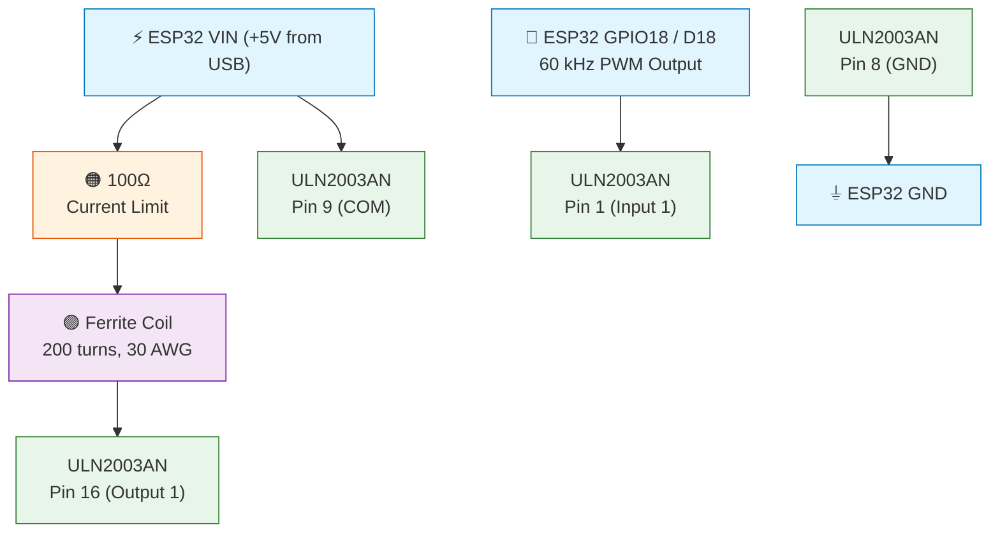
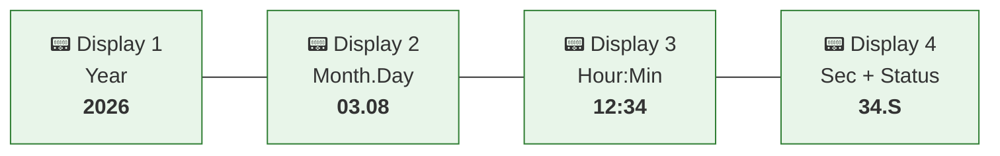

# Tesseract — WWVB 60 kHz Time Signal Transmitter

A low-power ESP32-based WWVB transmitter that synchronizes "atomic" clocks indoors by rebroadcasting the 60 kHz time signal using NTP as the time source.

## Problem

Five WWVB "atomic" clocks in a Seattle home can't reliably receive the Fort Collins, CO transmitter (~800 miles). They only sync after extended rooftop exposure, then drift several minutes over 2-3 months.

## Solution

An ESP32 acquires accurate UTC time via NTP from local stratum-1 GPS-disciplined servers, encodes it into the WWVB amplitude-modulated format, and transmits at 60 kHz through a ferrite rod antenna — continuously, 24/7, within FCC Part 15 limits.

## Hardware

| Component | Spec | Cost |
|-----------|------|------|
| ESP32 DevKit | HiLetgo ESP32-WROOM-32D ([Amazon B08D5ZD528](https://www.amazon.com/gp/product/B08D5ZD528)) | ~$6 |
| Ferrite Rod | 10mm × 200mm, material 61 or 77 | ~$12 |
| Magnet Wire | 30 AWG enameled copper, ~50 feet | ~$9 |
| Driver IC | ULN2003AN Darlington array (DIP-16) | ~$2 |
| Current Limit Resistor | 100Ω (start conservative) | — |
| **Total** | | **~$29** |

### Circuit



> **ULN2003AN DIP-16 pinout** (notch on left): Pin 1 = bottom-left (Input 1), Pin 8 = top-left (GND), Pin 9 = top-right (COM/+5V), Pin 16 = bottom-right (Output 1)

### Antenna Construction

1. Wind 200 turns of 30 AWG magnet wire tightly on the ferrite rod
2. Mark every 50 turns with tape for counting
3. Leave 6" of wire free at each end
4. Secure coil with tape or clear nail polish
5. Scrape enamel off wire ends for electrical contact

## Software Setup

### Prerequisites
- [Arduino IDE](https://www.arduino.cc/en/software) with ESP32 board support
- **ESP32 Arduino Core 3.x** (uses `ledcAttach`/`ledcWrite` API, not the older channel-based API)
- Board: **ESP32 Dev Module** (works with both 30-pin and 38-pin variants)
- Baud rate: **115200**

### Install ESP32 Board Support
1. Arduino IDE → File → Preferences
2. Add to "Additional Board Manager URLs":
   ```
   https://raw.githubusercontent.com/espressif/arduino-esp32/gh-pages/package_esp32_index.json
   ```
3. Tools → Board → Boards Manager → Search "esp32" → Install

### Configure WiFi & NTP Credentials

Credentials are stored in `credentials.h` files that are **never committed to git**.

**For the main program:**
1. Copy `wwvb_transmitter/credentials_template.h` → `wwvb_transmitter/credentials.h`
2. Edit `credentials.h` with your real WiFi and NTP settings:
```cpp
const char* const WIFI_SSID     = "your-network-name";
const char* const WIFI_PASSWORD = "your-wifi-password";
const char* const NTP_SERVER_1  = "192.168.1.100";   // Your local NTP server
const char* const NTP_SERVER_2  = "192.168.1.101";   // Backup NTP server
const char* const NTP_SERVER_3  = "pool.ntp.org";     // Internet fallback
```

**For WiFi-dependent tests** (same process in each test directory):
- `tests/test_ntp_client/credentials_template.h` → `credentials.h`
- `tests/hardware_validation/credentials_template.h` → `credentials.h`

> **Security:** `credentials.h` is in `.gitignore` and will never be committed. Only the templates (with placeholder values) are tracked in git.

### Upload the Main Program

1. In Arduino IDE: **File → Open**
2. Navigate to `wwvb_transmitter/wwvb_transmitter.ino`
3. Arduino IDE automatically loads all module files (`.h`/`.cpp`) as tabs
4. Select **ESP32 Dev Module** as the board
5. Select the correct COM port
6. Click **Upload**
7. Open Serial Monitor at **115200 baud**

> **Note:** Arduino IDE opens individual `.ino` files, not directories. When you open `wwvb_transmitter.ino`, it automatically sees all `.h` and `.cpp` files in the same folder. There is no equivalent to GCC's `-I` include path.

## Testing

Five standalone test sketches validate each component independently. **All tests are fully self-contained** — just open the `.ino` file in Arduino IDE, upload to the ESP32, and read results in Serial Monitor. No file copying required.

### How to Run Any Test
1. In Arduino IDE: **File → Open**
2. Navigate to the test's `.ino` file (e.g., `tests/test_wwvb_encoder/test_wwvb_encoder.ino`)
3. Select **ESP32 Dev Module** as the board
4. Select the correct COM port
5. Click **Upload**
6. Open Serial Monitor at **115200 baud**
7. Read PASS/FAIL results

### 1. Encoder Unit Tests (No Hardware Needed)
```
tests/test_wwvb_encoder/test_wwvb_encoder.ino
```
Self-contained — all encoder logic inlined. Runs 100+ tests covering BCD encoding, marker placement, reserved bits, time rollovers, DST logic, leap year handling, and reference frame validation.

**Run this first** — validates all encoding logic before touching hardware.

### 2. DST Calculation Tests (No Hardware Needed)
```
tests/test_dst_calculation/test_dst_calculation.ino
```
Self-contained — all DST logic inlined. Tests day-of-week calculation, DST transition dates for 2024-2030, UTC-to-local rollback, and full DST status for Pacific and Eastern timezones.

### 3. NTP Client Tests (WiFi Required)
```
tests/test_ntp_client/test_ntp_client.ino
```
Self-contained — uses ESP32 WiFi/NTP libraries directly. Edit WiFi credentials in the sketch, then upload. Tests WiFi connection, NTP sync, time monotonicity, UTC offset verification, second boundary precision, and WiFi reconnection.

### 4. PWM Output Tests (Oscilloscope Required)
```
tests/test_pwm_output/test_pwm_output.ino
```
Self-contained — uses ESP32 PWM APIs directly. Connect oscilloscope to GPIO 18. Upload and step through interactive tests: continuous 60 kHz carrier, on/off transitions, and bit timing verification (200ms/500ms/800ms pulses).

### 5. Hardware Validation (Full System)
```
tests/hardware_validation/hardware_validation.ino
```
Self-contained — encoder inlined. Full integration test: NTP sync → WWVB encode → transmit. Runs continuously with per-bit diagnostics, timing accuracy tracking, and system health monitoring. Place a WWVB clock near the antenna to test reception.

## Development Workflow

This project uses **VS Code for editing** and **Arduino IDE for building/uploading**.

| Tool | Purpose |
|------|---------|
| **VS Code** | Edit all code (`.ino`, `.h`, `.cpp`, specs, docs) |
| **Arduino IDE** | Compile, upload, and Serial Monitor only |

### VS Code Setup
- Open the `tesseract/` directory as your workspace
- All project files are visible and editable
- VS Code IntelliSense errors about `Arduino.h` are expected — VS Code doesn't have the ESP32 toolchain configured. These errors don't affect Arduino IDE compilation.

### Arduino IDE Setup
- **Do NOT set your sketchbook to this directory** — just open individual `.ino` files
- For the main program: open `wwvb_transmitter/wwvb_transmitter.ino`
- For any test: open the test's `.ino` file directly
- Arduino IDE automatically discovers sibling `.h`/`.cpp` files

## Project Structure

```
tesseract/
├── README.md                              # This file
├── .clinerules/
│   └── objective.md                       # Project rules for AI assistants
├── specs/                                 # Detailed technical documentation
│   ├── architecture.md                    # System architecture & decisions
│   ├── wwvb_protocol.md                   # WWVB encoding specification
│   ├── hardware_specs.md                  # ESP32, antenna, circuit details
│   ├── fcc_compliance.md                  # FCC Part 15 requirements
│   ├── ntp_integration.md                 # NTP client design & failover
│   ├── dst_calculation.md                 # Automatic DST algorithm & rules
│   ├── testing_strategy.md                # Test plan & acceptance criteria
│   ├── implementation_phases.md           # Development phases & milestones
│   └── references.md                      # External links & datasheets
├── wwvb_transmitter/                      # Main Arduino sketch
│   ├── wwvb_transmitter.ino               # Entry point (open this in Arduino IDE)
│   ├── config.h                           # WiFi, NTP, timezone configuration
│   ├── wwvb_encoder.h / .cpp              # WWVB time code encoder
│   ├── ntp_manager.h / .cpp               # NTP sync with failover
│   ├── dst_manager.h / .cpp               # Automatic DST calculation
│   └── debug_utils.h                      # Serial & LED helpers
└── tests/                                 # Self-contained test sketches
    ├── test_wwvb_encoder/                 # Encoder unit tests (self-contained)
    ├── test_dst_calculation/              # DST calculation tests (self-contained)
    ├── test_ntp_client/                   # NTP integration tests (self-contained)
    ├── test_pwm_output/                   # PWM/oscilloscope tests (self-contained)
    └── hardware_validation/               # Full system integration (self-contained)
```

## How It Works

1. **NTP Sync** — ESP32 connects to WiFi and syncs UTC time from local stratum-1 GPS-disciplined servers (sub-millisecond accuracy on LAN)
2. **WWVB Encode** — At the start of each minute, encodes the *next* minute's time into a 60-bit frame using BCD with position markers
3. **Transmit** — Each second, modulates the 60 kHz carrier by turning it off for 200ms (binary 0), 500ms (binary 1), or 800ms (marker), then back on for the remainder
4. **Receive** — WWVB clocks detect the amplitude changes and decode the time code

### Real-Time Timing Architecture

The main loop runs on a **100ms quantum state machine** aligned to UTC second boundaries — no blocking delays. Each quantum follows an execute-first pattern:

1. **Sleep** for the remainder of the 100ms quantum
2. **Execute** the action calculated in the previous quantum (carrier on/off)
3. **Read** current state (UTC time, NTP status)
4. **Calculate** the action for the next quantum

WWVB bit durations (200ms, 500ms, 800ms) align exactly to the 100ms grid, so carrier transitions happen at precise quantum boundaries. Display updates are scheduled at quantum 3 (300ms into each second), completely decoupled from transmission timing. This eliminates the jitter and display flicker that would result from blocking `delay()` calls during bit transmission.

## FCC Compliance

This device operates under [FCC Part 15.209](https://www.ecfr.gov/current/title-47/chapter-I/subchapter-A/part-15/subpart-C/section-15.209) — intentional radiator below 490 kHz. The limit is 40 μV/m at 300 meters at 60 kHz. The ferrite rod antenna is electrically tiny (wavelength = 5 km), making it inherently inefficient. Combined with low drive current and building attenuation, the transmitted signal stays well below FCC limits. See [`specs/fcc_compliance.md`](specs/fcc_compliance.md) for the full analysis.

## DST Configuration

DST status is **calculated automatically** from UTC time and your configured timezone. No manual switching needed — the transmitter handles spring forward and fall back transitions on its own.

Set your timezone in `config.h`:

```cpp
const int DEFAULT_TIMEZONE = -8;  // US Pacific (Seattle, WA)
                                   // -5 = US Eastern
                                   // -6 = US Central
                                   // -7 = US Mountain
```

The DST engine implements US rules per the Energy Policy Act of 2005:
- **Spring forward:** 2nd Sunday in March at 2:00 AM local
- **Fall back:** 1st Sunday in November at 2:00 AM local

On transition days, the WWVB signal broadcasts `DST_BEGINS` or `DST_ENDS` for the entire local calendar day, which tells clocks to adjust their display. See [`specs/dst_calculation.md`](specs/dst_calculation.md) for the full algorithm and edge case handling.

## Status Display Interface (Phase 6)

The transmitter includes a **master clock display panel** — a self-setting clock that sets other clocks.

### 7-Segment Display Panel

Four I2C 4-digit 7-segment displays (Adafruit HT16K33 backpack) showing local date/time:



**Display 4 status characters:** `.S` = Standard time, `.D` = DST in effect, `.E` = Error, `.C` = Connecting

### LED Status Panel

| LED | GPIO | Color | Meaning |
|-----|------|-------|---------|
| NTP Sync | GPIO 19 | 🟢 Green | Solid = synced, slow blink = aging, off = failed |
| WiFi | GPIO 23 | 🔵 Blue | Solid = connected, fast blink = connecting |
| Transmit | GPIO 25 | 🔴 Red | Brief flash each second = transmitting |

See [`specs/hardware_specs.md`](specs/hardware_specs.md) for complete GPIO pin assignments and I2C wiring details.

## Troubleshooting

| Issue | Check |
|-------|-------|
| Clock won't sync | Verify 60 kHz on oscilloscope; try closer range; check antenna orientation (broadside to rod = strongest) |
| WiFi won't connect | Verify SSID/password in `config.h`; check Serial Monitor for error messages |
| NTP sync fails | Verify NTP server IPs; try `pool.ntp.org` as primary; check firewall |
| Wrong time on clock | Verify UTC encoding (not local time); check DST status bits |
| No carrier output | Check GPIO 18 connection; verify PWM with `test_pwm_output` sketch |
| Short range | Reduce R2 (current limit); add resonant capacitor; verify coil winding |
| VS Code shows `Arduino.h` errors | Normal — VS Code doesn't have the ESP32 toolchain. Compilation in Arduino IDE works fine. |

## License

This project is for personal/educational use. WWVB signal format is defined by NIST. Ensure compliance with local radio regulations before operating.

## References

- [NIST WWVB](https://www.nist.gov/pml/time-and-frequency-division/radio-stations/wwvb) — Official WWVB documentation
- [ESP32 Arduino Core](https://github.com/espressif/arduino-esp32) — ESP32 board support
- [FCC Part 15.209](https://www.ecfr.gov/current/title-47/chapter-I/subchapter-A/part-15/subpart-C/section-15.209) — Field strength limits
- See [`specs/references.md`](specs/references.md) for complete reference list
