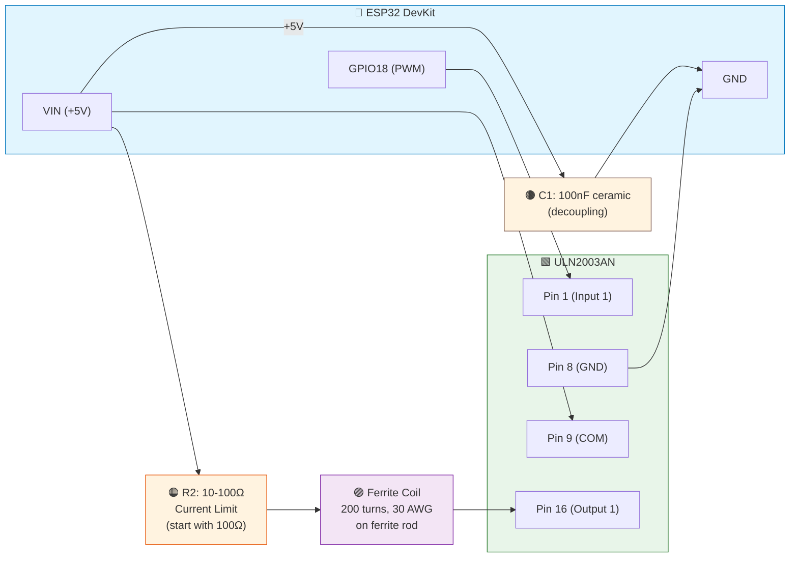
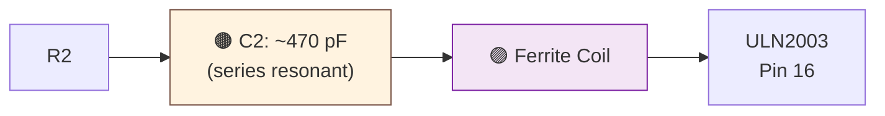
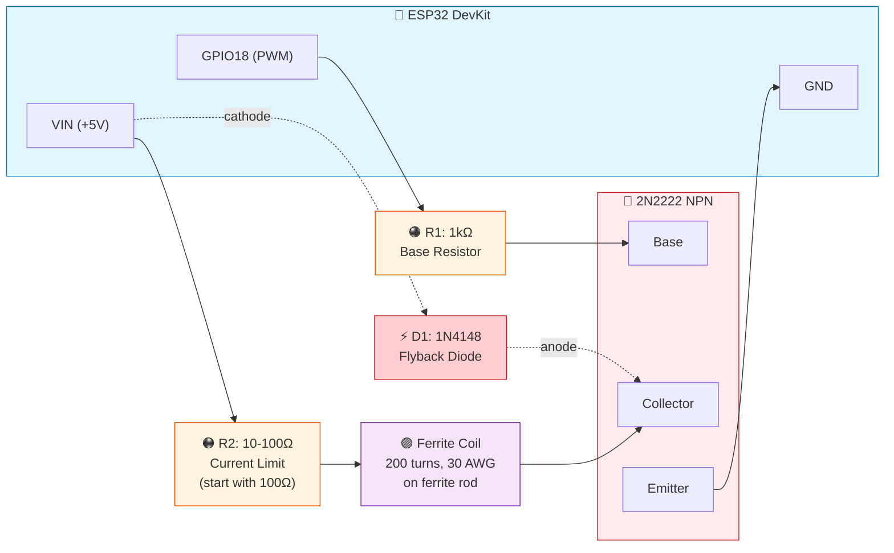

# Hardware Specifications

## ESP32 DevKit
- **Part:** HiLetgo ESP32-WROOM-32D DevKit (Amazon B08D5ZD528)
- **Chip:** ESP32-WROOM-32D/E
- **USB-Serial:** CP2102
- **Regulator:** 3.3V onboard
- **Connector:** Micro-USB
- **Power consumption:** 80mA idle + WiFi, ~100-150mA transmitting
- **GPIO:** All 3.3V (not 5V tolerant)
- **Clock:** Dual-core 240 MHz

### Board Variants
ESP32 DevKit boards come in **30-pin** and **38-pin** variants. Both work identically for this project — only the physical pin count and layout differ.

| Feature | 30-pin Board | 38-pin Board |
|---|---|---|
| Pin count | 15 per side | 19 per side |
| GPIO labeling | "D18", "D19", etc. | "GPIO18", "GPIO19", etc. |
| Size | Narrower | Wider |
| Extra pins | — | GPIO 6-11 (flash, don't use) |

**Note:** GPIO 18 may be labeled **"D18"** on 30-pin boards. Both refer to the same pin.

### Pin Selection
- **PWM Output:** GPIO 18 / D18 (safe pin, no strapping function)
- **Status LED:** GPIO 2 / D2 (built-in LED on most DevKits)
- **Avoid:** GPIO 0, 2, 5, 12, 15 (strapping pins with boot implications)
- **Safe GPIOs:** 16, 17, 18, 19, 21, 22, 23, 25, 26, 27, 32, 33

### LEDC PWM Peripheral
- 16 independent PWM channels (8 high-speed, 8 low-speed)
- Hardware-generated waveform (no CPU involvement once configured)
- Frequency range: 1 Hz to 40 MHz
- Resolution: 1-20 bits
- **Our config:** GPIO 18, 60 kHz, 8-bit resolution (0-255 duty)
- **ESP32 Core 3.x API:** `ledcAttach(pin, freq, resolution)` + `ledcWrite(pin, duty)`

## Ferrite Rod Antenna
- **Dimensions:** 10mm diameter × 200mm length
- **Material:** Type 61 or 77 (high permeability at LF frequencies)
- **Permeability:** μ ≈ 125 (material 61) or μ ≈ 2000 (material 77)

### Coil Winding
- **Wire:** 30 AWG enameled copper (magnet wire)
- **Turns:** 200
- **Coil length:** ~50mm on the rod (tightly wound, single layer)
- **Expected inductance:** ~10-20 mH
- **Wire needed:** ~50 feet

### Winding Instructions
1. Leave 6" of wire free at start
2. Wind 200 turns tightly, side-by-side (no overlap)
3. Mark every 50 turns with tape for counting
4. Leave 6" of wire free at end
5. Secure coil with tape or clear nail polish
6. Scrape enamel off wire ends for electrical contact

### Why 200mm Rod
- Magnetic moment ∝ rod length
- 2× length ≈ 2× field strength vs 100mm rod
- Better whole-house coverage
- Can always reduce power if too strong

## Driver Circuit (ULN2003AN Darlington Array)

### Why ULN2003AN Over a Discrete Transistor
- **Built-in flyback diodes** — protects against inductive kickback from the ferrite coil
- **No base resistor needed** — internal 2.7kΩ input resistors
- **3.3V logic compatible** — drives directly from ESP32 GPIO
- **500mA per channel** — 10× headroom over ~50mA coil current
- **50V output capability** — well above the 5V supply
- **7 spare channels** — only using 1 of 7

### ULN2003AN DIP-16 Pinout

```
          ┌──⚬──┐  ← notch/dot on left
  Input 1 │ 1  16│ Output 1    ← ACTIVE CHANNEL
  Input 2 │ 2  15│ Output 2
  Input 3 │ 3  14│ Output 3
  Input 4 │ 4  13│ Output 4
  Input 5 │ 5  12│ Output 5
  Input 6 │ 6  11│ Output 6
  Input 7 │ 7  10│ Output 7
      GND │ 8   9│ COM
          └──────┘
```

> ⚠️ **Pin 8 vs Pin 9 labeling:** Datasheets label Pin 8 as "GND" or "E" (common emitters → ground) and Pin 9 as "COM" (common diode cathodes → +V supply for flyback return). Don't confuse them — Pin 8 goes to ground, Pin 9 goes to +5V.

### ULN2003AN Specifications
- **Package:** DIP-16
- **Max Ic (per channel):** 500 mA
- **Max Vce:** 50V
- **Input resistor:** 2.7kΩ (internal)
- **Flyback diodes:** Internal (output to VCC)
- **Propagation delay:** ~1 μs (well under 60 kHz period of 16.7 μs)

### Schematic



> **Decoupling:** C1 (100nF ceramic) across the +5V and GND rails, placed close to the ULN2003AN. Add a 10μF electrolytic in parallel if using a long USB cable.

### Pin Connections

| ULN2003AN Pin | Function | Connects To |
|---------------|----------|-------------|
| Pin 1 | Input 1 | ESP32 GPIO 18 (PWM output) |
| Pin 8 | GND (common emitters) | ESP32 GND |
| Pin 9 | COM (flyback diode return) | ESP32 VIN (+5V) |
| Pin 16 | Output 1 | Ferrite coil (other end to R2 → +5V) |
| All others | Unused | Leave unconnected |

### Component Values
- **R2 (current limit):** Start with 100Ω, reduce if more range needed
  - Limits coil current to ~50 mA at 5V
  - Power dissipation: 0.25W (1/4W resistor OK)
- **No base resistor needed** — ULN2003AN has internal 2.7kΩ input resistors

### Resonant Circuit (Optional Enhancement)
- Add capacitor in series with coil to resonate at 60 kHz
- C = 1 / (4π²f²L)
- For L=15mH: C ≈ 470 pF
- Increases Q factor, improves efficiency
- Only add if range is insufficient without it



> **Tuning:** Measure actual coil inductance with an LCR meter, then calculate C2 = 1/(4π²f²L). Use a ceramic NPO/C0G capacitor for stability. Parallel combination of standard values may be needed (e.g., 330pF + 150pF = 480pF).

## Alternative: 2N2222 Transistor Driver Circuit

If ULN2003AN is unavailable, a discrete 2N2222 NPN transistor can be used instead. This requires an additional base resistor and external flyback protection.

### 2N2222 Schematic



> **2N2222 TO-92 pinout** (flat side facing you): Left = Emitter, Center = Base, Right = Collector
>
> **Flyback diode D1:** 1N4148 placed across the coil+collector junction. Cathode to +5V rail, anode to collector. Clamps inductive kickback when the transistor switches off.

### 2N2222 NPN Transistor
- **Package:** TO-92
- **Max Ic:** 800 mA
- **Max Vce:** 40V
- **hFE (gain):** 100-300
- **fT:** 300 MHz (well above 60 kHz)

### 2N2222 Component Values
- **R1 (base resistor):** 1kΩ
  - GPIO voltage: 3.3V
  - Base current: (3.3V - 0.7V) / 1kΩ ≈ 2.6 mA
  - With hFE=100, can switch up to 260 mA collector current
- **R2 (current limit):** Start with 100Ω, reduce if more range needed
  - Limits coil current to ~50 mA at 5V
  - Power dissipation: 0.25W (1/4W resistor OK)
- **Flyback diode (recommended):** 1N4148 across coil (cathode to +5V)

## Status Display Interface

### 7-Segment Display Panel (4× Adafruit HT16K33 Backpack)
- **Part:** Adafruit 0.56" 4-Digit 7-Segment Display w/ I2C Backpack ([#880](https://www.adafruit.com/product/880))
- **Quantity:** 4
- **Controller:** HT16K33
- **Interface:** I2C (shared bus)
- **Voltage:** 3.3V or 5V (backpack has onboard regulator)

Four I2C 4-digit 7-segment displays showing complete local date/time and system status.

| Display | Address | Jumpers | Content | Example |
|---------|---------|---------|---------|---------|
| 1 | 0x70 | None (default) | Year (local) | `2026` |
| 2 | 0x71 | A0 bridged | Month.Day (local) | `03.11` |
| 3 | 0x72 | A1 bridged | Hour:Min (local) | `16:40` |
| 4 | 0x73 | A0 + A1 bridged | Second + Status | `34.d` |

> **Local time:** Displays show local time based on the configured timezone
> (`DEFAULT_TIMEZONE` in `config.h`). DST adjustment is automatic.
> The WWVB signal itself always transmits UTC — only the display is local.

**I2C Address Jumpers:** On the back of each HT16K33 backpack, bridge solder pads A0/A1/A2 to set the address. Only A0 and A1 are needed for 4 displays.

**Display 4 Status Characters:**
- `.S` = Standard time (no DST)
- `.d` = DST in effect
- `.E` = Error condition
- `.C` = Connecting/syncing

**I2C Bus:**
- **SDA:** GPIO 21
- **SCL:** GPIO 22
- **Library:** Adafruit LED Backpack + Adafruit GFX (install via Arduino Library Manager)
- **Update rate:** Every second
- **No pull-up resistors needed** — HT16K33 backpack has onboard pull-ups

**Software module:** `display_manager.h` / `display_manager.cpp`

### LED Status Panel (3 LEDs, Direct ESP32 Drive)

LEDs are driven directly from ESP32 GPIO pins — no ULN2003AN needed.
ESP32 GPIO can source up to 40mA; status LEDs draw ~5-7mA each.

| LED | GPIO | Color | Meaning |
|-----|------|-------|---------|
| NTP Sync | GPIO 19 | 🟢 Green | Solid = synced (<1hr), slow blink = aging (>1hr), off = failed/stale |
| WiFi | GPIO 23 | 🔵 Blue | Solid = connected, fast blink = connecting, off = disconnected |
| Transmit | GPIO 25 | 🔴 Red | Brief 50ms flash each second = transmitting |

**Wiring (each LED):** `ESP32 GPIO → LED anode (+) → 220Ω resistor → GND`

**Current per LED (with 220Ω resistor at 3.3V GPIO):**
| LED Color | Typical Vf | Current | Notes |
|-----------|-----------|---------|-------|
| Red | 1.8V | ~6.8mA | Bright |
| Green | 2.2V | ~5.0mA | Bright |
| Blue | 3.0V | ~1.4mA | **Dim** — reduce to 100Ω if needed |

> ⚠️ **Blue LED note:** Blue LEDs have Vf ≈ 3.0V, leaving only ~0.3V headroom
> from a 3.3V GPIO. With 220Ω this yields ~1.4mA which may appear dim.
> Options: (1) reduce resistor to 100Ω, (2) use a low-Vf blue LED, or
> (3) substitute a green LED for WiFi status.

**Software module:** `status_leds.h` / `status_leds.cpp`

### GPIO Pin Summary

| GPIO | Function | Notes |
|------|----------|-------|
| 18 (D18) | 60 kHz PWM output | WWVB carrier signal |
| 2 (D2) | Built-in LED | Basic heartbeat (existing) |
| 19 (D19) | NTP sync LED | Green LED |
| 23 (D23) | WiFi status LED | Blue LED |
| 25 (D25) | Transmit status LED | Red LED |
| 21 (D21) | I2C SDA | 7-segment displays |
| 22 (D22) | I2C SCL | 7-segment displays |

## Target WWVB Clocks

| # | Model | Location | Sync Button | Notes |
|---|-------|----------|-------------|-------|
| 1 | Marathon CL030052BK | TBD | TBD | Wall clock, WWVB 60 kHz |
| 2 | TBD | TBD | TBD | |
| 3 | TBD | TBD | TBD | |
| 4 | TBD | TBD | TBD | |
| 5 | TBD | TBD | TBD | |

All target clocks receive the **WWVB 60 kHz** amplitude-modulated signal. Most clocks auto-sync at 2-4 AM but can be forced via a "WAVE", "RCC", or radio tower button on the back.

## Power Supply
- **Source:** USB wall adapter (5V, 1A minimum)
- **ESP32 power:** Via Micro-USB connector
- **Antenna power:** Via 5V pin on DevKit (USB passthrough)
- **Total consumption:** ~150-200 mA at 5V (~1W)

## Breadboard Layout (ULN2003AN)
```
                         ESP32 DevKit
                        ┌───────────┐
                   VIN ─┤           ├─ GPIO 18
                   GND ─┤           │
                        └───────────┘
                          │   │   │
+5V rail ─────────────────┘   │   │
           │  C1 (100nF)      │   │
           ├──┤── GND rail    │   │
           │                  │   │
           │    R2 (100Ω)     │   │
           ├─────┤            │   │
           │  Ferrite Coil    │   │
           │     │            │   │
           │   Pin 16 (Out1)  │   │
           │         ┌──⚬──┐  │   │
           │  Pin 9 ─┤     │  │   │
           │  (COM)  │ ULN │  │   │
           │         │2003 │  │   │
           │  Pin 1 ─┤     ├──┘   │
           │         │     │      │
           │  Pin 8 ─┤     │      │
           │    │    └─────┘      │
GND rail ──┴────┘                 │
                                  │
(GPIO 18 connects to Pin 1) ─────┘
```

### Breadboard Layout (2N2222 Alternative)
```
                         ESP32 DevKit
                        ┌───────────┐
                   VIN ─┤           ├─ GPIO 18
                   GND ─┤           │
                        └───────────┘
                          │   │   │
+5V rail ─────────────────┘   │   │
           │                  │   │
           │    R2 (100Ω)     │   │
           ├─────┤            │   │
           │  Ferrite Coil    │   │
           │     │            │   │
           │  D1 (1N4148)     │   │
           ├──|◁─┤            │   │
           │     │            │   │
           │     C (collector)│   │
           │     ┌───┐        │   │
           │     │2N │        │   │
           │     │222│        │   │
           │     │2  │        │   │
           │     └─┬─┘        │   │
           │   B   │ E        │   │
           │   │   │          │   │
           │   R1  │          │   │
           │  (1kΩ)│          │   │
           │   │   │          │   │
           │   │   │  GPIO 18─┘   │
GND rail ──┴───┴───┘              │
                                  │
(GPIO 18 connects to R1) ────────┘
```
> **D1 orientation:** The 1N4148 band (cathode) faces the +5V rail. Anode connects to the collector/coil junction.
